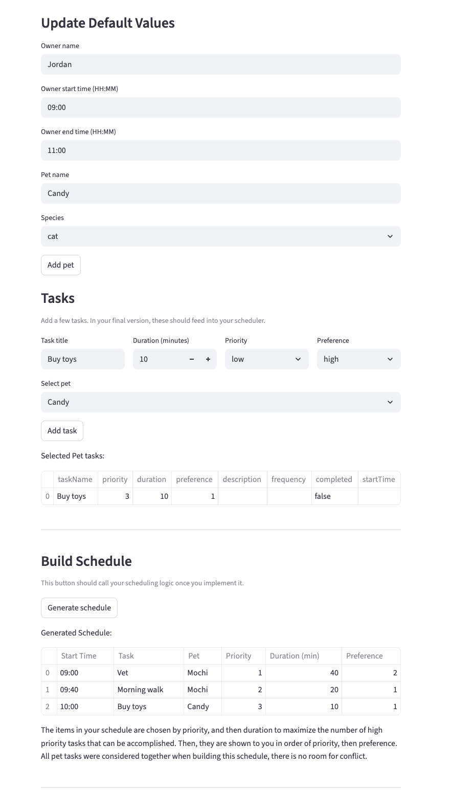

# PawPal+ (Module 2 Project)

You are building **PawPal+**, a Streamlit app that helps a pet owner plan care tasks for their pet.

## Scenario

A busy pet owner needs help staying consistent with pet care. They want an assistant that can:

- Track pet care tasks (walks, feeding, meds, enrichment, grooming, etc.)
- Consider constraints (time available, priority, owner preferences)
- Produce a daily plan and explain why it chose that plan

Your job is to design the system first (UML), then implement the logic in Python, then connect it to the Streamlit UI.

## What you will build

Your final app should:

- Let a user enter basic owner + pet info
- Let a user add/edit tasks (duration + priority at minimum)
- Generate a daily schedule/plan based on constraints and priorities
- Display the plan clearly (and ideally explain the reasoning)
- Include tests for the most important scheduling behaviors

## Getting started

### Setup

```bash
python -m venv .venv
source .venv/bin/activate  # Windows: .venv\Scripts\activate
pip install -r requirements.txt
```

### Suggested workflow

1. Read the scenario carefully and identify requirements and edge cases.
2. Draft a UML diagram (classes, attributes, methods, relationships).
3. Convert UML into Python class stubs (no logic yet).
4. Implement scheduling logic in small increments.
5. Add tests to verify key behaviors.
6. Connect your logic to the Streamlit UI in `app.py`.
7. Refine UML so it matches what you actually built.

## Smarter Scheduling
My scheduling algorith considers both the priorities and durations of tasks when deciding what goes on the schedule. It considers task priority and preference when arranging the tasks in order. The way this algorithm schedules tasks does not allow for conflict, so there is no need for conflict detection. 

## Testing PawPal+
python -m pytest

I tested the following behaviors
- marking tasks as complete unless they have daily frequency
- creating additional pets and adding them to owner
- each of my sorting methods (priority and duration, priority and preference)
- calculating owner time constraints based on their availability start and end times
- calculating a schedule (full workflow owner -> pets -> tasks -> schedule)

Confidence Level: 4 stars

---

## Features

- Add multiple pets for a single owner
- Add and view pet care tasks for each pet (remove is not in UI)
- Assign priorities and durations to tasks
- Specify owner availability window for scheduling
- Automatically generate a daily schedule based on priorities and time constraints
- Mark tasks as completed (with special handling for daily tasks)
- View generated schedule in a user-friendly table
- Interactive Streamlit UI for all features

## Demo
<a href="demo.png" target="_blank"></a>